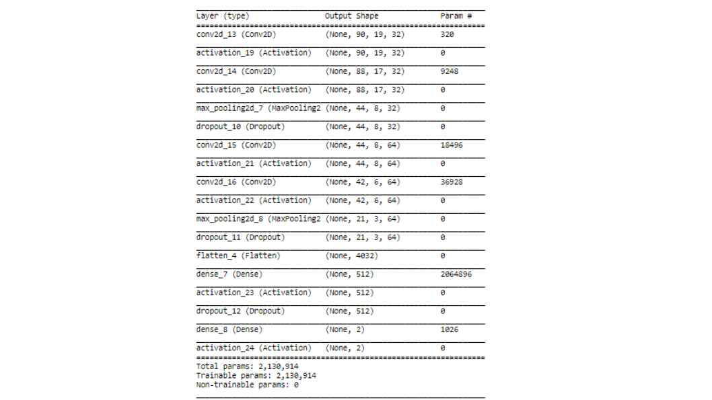
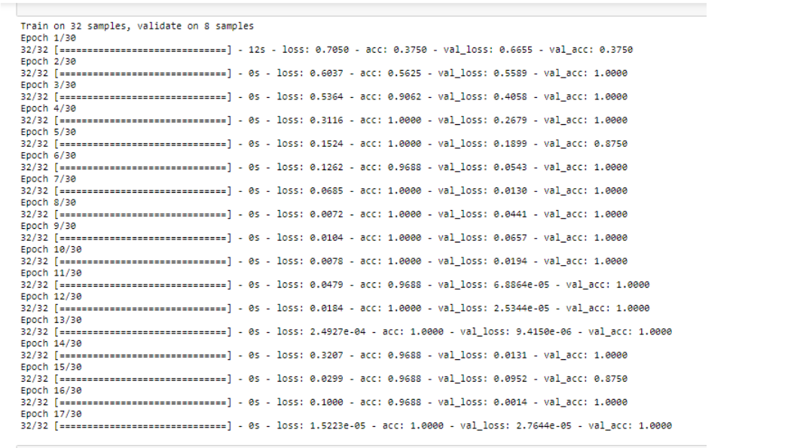
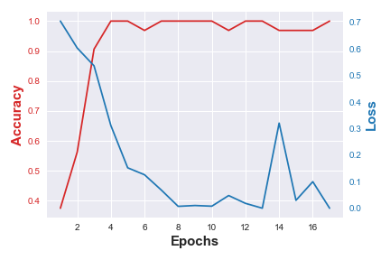

# Visual-Inspection-for-Chipset-Quality-Control
 

For years the industry has been striving to cram more and more circuitry onto tiny silicon chips, allowing for faster and smaller electronic devices. But less attention was paid to the fact that electrical signals still have to be carried into and out of the chip throughout the packaging. Today, it is the packaging that is emerging as a bottleneck, restricting efforts to increase the speed and shrink the size of electronic devices.

  
 
Figure 1: Image of a chipset, connected via wire bonds to the substrate board. 
  

The package is what many people envision when they think of an electronic chip. The chip itself is a flat piece of silicon, no bigger than a fingernail, that is etched with tiny circuits. The package around the chip is black plastic or ceramic with many metal prongs coming out of it.(See Fig. 1) 

One problem in semiconductor manufacturing is that as chips become more complex, more wires are needed to carry signals in and out of the chip. Some of the most complex chips require a few hundred such wires. It becomes increasingly difficult to place all those wires around the edge of the chip without the signals on the wires interfering with one another. 

In many modern chips, the space between the leads is only 0.5 mm apart. The coverage of the material dispensed during the manufacturing process is critical to the reliability and performance of the package. The presence of voids and variations in thickness are undesirable. Excessive or insufficient coverage of the die attach material makes the device susceptible to reliability failures. Lack of thickness control can contribute to reliability failures and impact the subsequent wire bond process. 

Wire bonds are the most common means of providing an electrical connection from the device to the substrate/ Leadframe. The wire bond process must achieve high throughput and production yields to be acceptable on a cost basis. High-speed wire bond equipment consists of a handling system to feed the substrate/leadframe into the work area. Wires are bonded one wire at a time and typical bond line thickness is between 1 to 2 mm.  Computer vision and Image recognition systems are common practice to ensure the die is orientated to match the bonding diagram for a particular device. 
  
 
Figure 2: Sample of normal and defected wire bonds. Red arrows depicts clearance defect and close proximity to the other bonds. 
  

Visual techniques are usually used to ensure the proper ball and wedge bonds have been formed. Visual inspection also verifies the bonds are properly placed with respect to the bond pads and bond fingers of the leadframe/substrate. Besides that, the visual inspection also screens possible bond defects that may results to an open or short based on a specified defined criteria of wire clearance & close proximity of each bond to the other. (See Fig. 2)

This work is going to develop a cognitive visual inspection model to classify defected chip lead from normal one as a measure of Quality Control (QC) throughout fabrication process. 

The dataset is collected by anonymous manufacturer and consists of 353 black and with figure in PNG format. Among them, only 30 figures represent defected bond finger as depicted in figure 2.    

  
## Image to numerical array
 
Converting these figures to numerical data in matrix format is first step of the work. Here, all figures are first read as color image with three RGB channels and then transformed to single gray array. Since, not all figures are at the same size, they are next normalized to 180x38  and then resized to 90x19. Developed functions for this section can be found in project repository under “Image2Array” title.    

  
## Model Development (Convolutional Neural Network)
 
Convolutional Neural Network(CNN) is the obvious choice for tasks related to computer vision.  Because of explicit criteria of normal/defect classification, making distinction between two classes is not difficult. Therefore,  for the purpose of this project, relatively simple architecture, consisting number of convolutional layers, pooling layers and dropout layers in addition to dense layers are developed. Detailed architecture of the model is shown in figure 3.   

  
 
Figure 3: CNN Model Summary. 
  

From original dataset, final dataset is chosen in a way to have 30 normal and 30 defected samples. Final dataset then split to 2/3 training-set and 1/3 test-set. 20% of training-set also hold out for validation purposes.  

  
 
Figure 4: CNN Model Performance. 
  

Figure 4 & 5 clearly show that even such a small dataset can result in reasonable performance. In classification task usually other metrics rather than accuracy is used to evaluate model performance, but here, since both classes are presented evenly, accuracy can be considered as acceptable measure.

  
 
Figure 5: Variation of model accuracy and loss over training epochs. 
  

Final validation on test-set also reveled 100 % accuracy with relatively small loss. This result confirms that train model is not over fitted and can well generalize on unseen data.     
  
Test loss: 0.00599464727566
Test accuracy: 1.0
  
Developed functions for this section can be found in project repository under “CNN_Model” and “ PreProcessing” titles.

 
http://www.nytimes.com/1985/11/07/business/technology-a-bottleneck-chip-s-package.html
http://www.ti.com/lit/an/snoa286/snoa286.pdf
